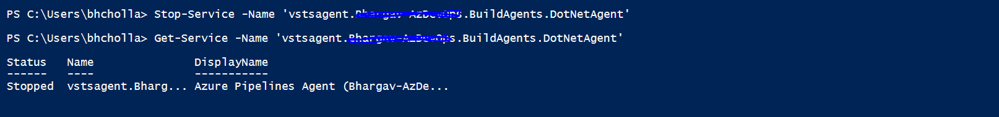

# Use Azure Automation State Configuration to Deploy and Monitor Self-hosted agents in Azure DevOps


Azure DevOps is a great service from Microsoft which can be used for Source Control, CI & CD etc. While using build pipelines, there are often situation where Microsoft-hosted agent are not sufficient and Self-hosted agent have to be adopted. These agent come with the overhead of deployment and maintenance. In this article, we will see how we can leverage Automation State Configuration to automate this process. 

### Before proceeding further…
- You need to have a basic understanding of [Azure Pipelines](https://docs.microsoft.com/en-us/azure/devops/pipelines/?view=azure-devops) and [Desired State Configuration](https://docs.microsoft.com/en-us/azure/virtual-machines/extensions/dsc-overview).
- You need to have an Azure DevOps account and an Organization created. Create one from [this link](https://azure.microsoft.com/en-us/services/devops/) if you do not have any.
- You need to have an Azure Subscription. Create one from [this link](https://azure.microsoft.com/en-in/resources/videos/sign-up-for-microsoft-azure/) if you do not have any.
- You need to have an Azure Automation Account and Windows VM which needs to be used as the build agent deployed in a resource group.

## What is Azure Automation State Configuration ?
State Configuration is one offering from Azure Automation which helps to define, manage and compile DSC configurations. State Configuration also provides a way to connect any node (cloud or on-premises), assign a configuration to that node and monitor the compliance status of these nodes using a dashboard at scale. This is a very good feature which is used by many IT administrators to bootstrap and monitor machines in their organization.

DSC configuration can also reference the [Automation Assets](https://docs.microsoft.com/en-us/azure/automation/automation-dsc-compile#work-with-assets-in-azure-automation-during-compilation) like variables, credentials etc. This will help in using sensitive data in the DSC configurations without having to expose or share them with unintended audience. We will look at an example of this in the later sections.

You can learn more from the official docs [here](https://docs.microsoft.com/en-us/azure/automation/automation-dsc-overview).

## Automate the Self-hosted agent provisioning.
To achieve this we need to first define the DSC configurations.

Pre-Requisites for deploying a self-hosted agent on windows machine can be found [here](https://docs.microsoft.com/en-us/azure/devops/pipelines/agents/v2-windows?view=azure-devops#check-prerequisites). Along with this, we need to install additional tools depending on the type of solutions that we want to build on the agent. Let us assume that we want to have two different build agents.

- <ins>DotNetAgent</ins>- This is used to build backend solutions written in .NET
- <ins>NodeJsAgent</ins>- This is used to build front end solution written in Node.

We can have a single agent to build both the type of solutions, but here we are considering two different agents as an example to show how different agent can be provisioned on need basis. To create agents with above requirements, we need to install the following tools.

- .NET Framework
- Visual Studio Build Tools
- Node.Js
- AzureDevOps Agent

### DSC Configuration for .NET & Build Tools

For this we will using DSC Package resource. We can install the build tools which will also install .NET framework as part of its installation. The workload components that have to be installed as part of the installation can be defined in the arguments. Here we are installing only 'Microsoft.VisualStudio.Workload.AzureBuildTools' which installs .NET 4.7.2. You can customize the arguments as per the need by referring the document here.

### DSC Configuration for Node.JS

For this too, we will be using DSC package resource. Since we want to have separate build agent for Node.JS we can have this package included on conditional basis for a Node.

### DSC Configuration for Build Agent

We will use DSC script resource to achieve this. To install an agent as per the documentation here, we need to download the agent package, extract it, run the config.cmd. Config.cmd can be run in unattended mode by passing in required arguments, we will be leveraging the same.

We will be configuring the agent to run as a service and auto logon so that the service will be run on startup. Once the agent is configured, if there are any changes to the tools installed then the agent has to be restarted for the new capabilities to be listed. To achieve this we will be using a checksum which is based on compilation timestamp. If the configuration is re-compiled to add any new changes to agent, then the checksum will mismatch and trigger the re-start of the agent that is already running.

Once the agent is successfully configured, '.agent' is created in the agent directory which contains the pool information. We will check the existence of this file to confirm the configuration of the agent on the machine.
Note: '.agent' is a hidden file and will not be visible by default in explorer.

Below is the final configuration script. You can see that the configuration script uses Automation Variables asset to retrieve the DevOpsPAT token. This way the variable can be created only once by the Admin and it can be used later by anyone without having to know the value.

```
Configuration SelfHostedAgent
{
    param
    (
        [Parameter(Mandatory = $true)]
        [string]$DevOpsOrganizationName,

        [Parameter(Mandatory = $false)]
        [string]$DevOpsPersonalAccessToken
    )

    $agentDownloadUri = 'https://vstsagentpackage.azureedge.net/agent/2.182.1/vsts-agent-win-x64-2.182.1.zip'
    $devOpsUri = "https://dev.azure.com/$DevOpsOrganizationName"

    if ([String]::IsNullOrEmpty($DevOpsPersonalAccessToken)) {
        $DevOpsPersonalAccessToken = Get-AutomationVariable -Name 'DevOpsPersonalAccessToken'
    }

    Node $AllNodes.NodeName
    {
        $agentName = $Node.AgentName
        $agentPoolName = $Node.AgentPoolName
        $agentId = "vstsagent.$DevOpsOrganizationName.$agentPoolName.$agentName"
        $agentDirectoryPath = Join-Path 'C:' $agentId
        $agentConfigPath = Join-Path $agentDirectoryPath '.agent'
        $agentChecksumFilePath = Join-Path $agentDirectoryPath 'AgentCheckSum'
        $agentChecksum = (Get-Date).Ticks.ToString()
        $agentDependsOn = @('[Package]VSBuildTools')
        if ($Node.IncludeNodeJs) {
            $agentDependsOn += '[Package]NodeJs'
        }

        Package VSBuildTools
        {
            Name = 'Microsoft .NET Framework 4.7.2 Targeting Pack'
            Path = 'https://aka.ms/vs/16/release/vs_buildtools.exe'
            ProductId = '1784A8CD-F7FE-47E2-A87D-1F31E7242D0D'
            Arguments = '--add Microsoft.VisualStudio.Workload.AzureBuildTools --includeRecommended --installPath C:\BuildTools --wait --quiet --norestart'
            Ensure = 'Present'
        }

        if ($Node.IncludeNodeJs)
        {
            Package NodeJs 
            {
                Name = 'Node.js'
                Path = 'https://nodejs.org/dist/v14.16.0/node-v14.16.0-x64.msi'
                ProductId = '6fba594e-4bea-4ba0-a310-a74291707d0e'
                Arguments = '/quiet'
                Ensure = 'Present'
            }
        }

        Script AzureDevOpsAgent
        {
            GetScript = {     
                if ((Test-Path $using:agentDirectoryPath) -and (Test-Path $using:agentConfigPath)) {
                    $agentConfigData = Get-Content -Path $using:agentConfigPath
                }
                else {
                    $errorMessage = "Agent is not configured on the machine"
                    $agentConfigData = $errorMessage
                    Write-Warning $errorMessage
                } 
                return @{ 'Result' = "$agentConfigData" }
            }
            TestScript = {
                # Check if the agentchecksum mismatch.
                $previousAgentChecksum = Get-Content $using:agentChecksumFilePath -ErrorAction Ignore
                if ($previousAgentChecksum -ne $using:agentChecksum) {
                    Write-Warning 'AgentCheckSum mismatch...'
                    return $false
                }

                # Check if the agent directory exists but Agent is configured.
                if ((Test-Path $using:agentDirectoryPath) -and -not (Test-Path $using:agentConfigPath)) {
                    Write-Verbose 'Agent directory exists but the agent is not configured.'
                    return $false
                }

                # Check if the agent directory exists and Agent is configured.
                if ((Test-Path $using:agentDirectoryPath) -and (Test-Path $using:agentConfigPath)) {
                    Write-Verbose 'Agent directory exists and the agent is already configured.'
                    
                    # Check if the agent service is running.
                    $agentService = Get-Service -Name $using:agentId -ErrorAction Ignore
                    if ($null -ne $agentService -and $agentService.Status -eq 'Running') {
                        Write-Verbose 'Agent service is running.'
                        return $true
                    }
                }
                
                Write-Verbose 'Agent directory does not exist or the agent is not configured.'
                return $false
            }
            SetScript = {
                # Download the agent on to machine and extract it.
                if ((Get-ChildItem $using:agentDirectoryPath -ErrorAction Ignore).Count -eq 0) {
                    Write-Verbose "Agent is not present on the machine. Downloading now..."
                    $agentDownloadPath = Join-Path $env:TEMP "$(New-Guid).zip"
                    Invoke-WebRequest $using:agentDownloadUri -OutFile $agentDownloadPath -UseBasicParsing
                    Expand-Archive -LiteralPath $agentDownloadPath -DestinationPath $using:agentDirectoryPath 
                    Remove-Item $agentDownloadPath    
                    Write-Verbose "Agent succesfully downloaded and extracted to $using:agentDirectoryPath"             
                }

                # Agent is downloaded and extracted on to machine and Configure it
                if ((Test-Path $using:agentDirectoryPath) -and -not (Test-Path $using:agentConfigPath)) {
                    Write-Verbose "Agent is already downloaded and extracted to $using:agentDirectoryPath."
                    Write-Verbose "Agent is not configured, Configuring now..."

                    $agentConfigCmdPath = Join-Path $using:agentDirectoryPath 'config.cmd'

                    $startInfo = New-Object System.Diagnostics.ProcessStartInfo
                    $startInfo.FileName = $agentConfigCmdPath
                    $startInfo.Arguments = "--unattended --url $using:devOpsUri --auth pat --token $using:DevOpsPersonalAccessToken --pool $using:agentPoolName --agent $using:agentName --runAsAutoLogon --runAsService"
                    $startInfo.UseShellExecute = $false
                    $startInfo.RedirectStandardOutput = $true
                    $startInfo.RedirectStandardError = $true

                    $process = New-Object System.Diagnostics.Process
                    $process.StartInfo = $startInfo
                    $process.Start()
                    $process.WaitForExit()
                    $standardError = $process.StandardError.ReadToEnd()
                    $standardOutput = $process.StandardOutput.ReadToEnd()
                    $exitCode = $process.ExitCode

                    Write-Verbose "Config.cmd Output: $standardOutput"
                    Write-Verbose "Config.cmd ExitCode: $exitCode"
                    Write-Warning "Config.cmd Error: $standardError"

                    if ($process.ExitCode -ne 0) {
                        throw "Agent configuration failed."
                    }
                    Write-Verbose "Agent succesfully configured."

                    Set-Content $using:agentChecksum -Path $using:agentChecksumFilePath
                    Write-Verbose "AgentCheckSum ($using:agentChecksum) is updated at $using:agentChecksumFilePath"

                    # Check if the agent service is running.
                    $agentService = Get-Service -Name $using:agentId -ErrorAction Ignore
                    if ($null -ne $agentService -and $agentService.Status -eq 'Running') {
                        Write-Verbose 'Agent service is running.'
                        return
                    }
                    else {
                        throw "Agent is configured but agent service is not running, Manual troubleshooting is needed."
                    }  
                }  
                
                # Agent is already configured and a restart of agent service may be needed.
                if ((Test-Path $using:agentDirectoryPath) -and (Test-Path $using:agentConfigPath)) {
                    # Check if the agent service is running.
                    $agentService = Get-Service -Name $using:agentId -ErrorAction Ignore
                    if ($null -ne $agentService -and $agentService.Status -eq 'Running') {
                        Write-Verbose 'Agent service is running.'
                        $previousAgentChecksum = Get-Content $using:agentChecksumFilePath -ErrorAction Ignore
                        if ($previousAgentChecksum -ne $using:agentChecksum) {
                            Write-Verbose 'AgentCheckSum mis-match service restart is required. Attemping to restart...'
                            Restart-Service $using:agentId
                            Write-Verbose 'Agent service is restarted succesfully...'

                            # Update the agent checksum after restart
                            Set-Content $using:agentChecksum -Path $using:agentChecksumFilePath
                            Write-Verbose "AgentCheckSum ($using:agentChecksum) is updated at $using:agentChecksumFilePath"

                            return
                        }
                    }
                    else {
                        throw "Agent serivce is currently not running, Manual troubleshooting is needed."
                    }  
                }
            }
            DependsOn = $agentDependsOn
        }
    }
}
```

## Import and Compile the DSC Configuration

Let us now, import the configuration that we have created so far into an azure automation account and compile it. 


1. Create Automation Variable to store DevOps PAT Token. Ensure the PAT token has right permissions following steps here.

    ```
    # Create Automation Variable Asset to store PAT.
    New-AzAutomationVariable `
        -ResourceGroupName <AutomationResourceGroup> `
        –AutomationAccountName <AutomationName> `
        –Name 'DevOpsPersonalAccessToken' `
        –Value <DevOpsPATValue> `
        –Encrypted $true
    ```


*Variable Created in Automation* 

2. Import 'SelfHostedAgent.ps1' that we have define above.

    ```
    # Import the DSC configuration
    Import-AzAutomationDscConfiguration `
        -ResourceGroupName <AutomationResourceGroup> `
        –AutomationAccountName <AutomationName> `
        -SourcePath <Path-To-SelfHostedAgent.ps1> `
        -Force -Published
    ```

3. Compile the DSC configuration. Here we will be using ConfigurationData to create separate node configuration for different agents DotNetAgent and NodeJsAgent as describe above.

    ```
    $Parameters = @{
    'DevOpsOrganizationName' = <DevOpsOrgName>
    }
    $ConfigData = @{
        AllNodes = @(
            @{
                NodeName = 'BuildAgents.DotNetAgent'
                AgentName = 'DotNetAgent'
                AgentPoolName = 'BuildAgents'
            },
            @{
                NodeName = 'BuildAgents.NodeJsAgent'
                AgentName = 'NodeJsAgent'
                AgentPoolName = 'BuildAgents'
                IncludeNodeJs = $true
            }
        )
    }
    Start-AzAutomationDscCompilationJob `
        -ResourceGroupName <AutomationResourceGroup> `
        -AutomationAccountName <AutomationName> `
        -ConfigurationName 'SelfHostedAgent' `
        -Parameters $Parameters `
        -ConfigurationData $ConfigData
    ```

Once the configuration compilation is completed, there should be two different node configurations as below. 


*Compiled DSC Node Configurations in Automation*

## Onboard the VM to Automation DSC

We have the node configurations needed for agent onboarding. Let us now onboard the VM to be used as build agent to Automation DSC. We are using 'ApplyAndMonitor' as the configuration mode, this will apply the configuration and the report the compliance state back to the automation account.

Note: we are using agent pool name as 'BuildAgents'. This is not available by default. This agent pool has to be created before onboarding the agent.

```
Register-AzAutomationDscNode `
    -ResourceGroupName <AutomationResourceGroup> `
    -AutomationAccountName <AutomationName> `
    -AzureVMName <AzureVMName> `
    -AzureVMResourceGroup <AzureVMResourceGroup> `
    -AzureVMLocation <AzureVMLocation> `
    -NodeConfigurationName 'SelfHostedAgent.BuildAgents.DotNetAgent' `
    -ConfigurationMode 'ApplyAndMonitor' `
    -ConfigurationModeFrequencyMins 15 `
    -RefreshFrequencyMins 30 `
    -RebootNodeIfNeeded $true
```

Once the node is registered and reported compliant to automation dsc, you should be able to see the build agent successfully registered and online. The tools that are installed should be shown as part of agent capabilities.


*Build VMs Onboarded and Reporting Compliant*


*Build Agents Registered and Reporting Online*


*Agent installation directory on VM*


*Agent service configured and running on VM*


*Capabilities of DotNetAgent showing .NET Framework*


*Capabilities of NodeJsAgent showing .NET Framework and Node*

# Use the Self-Hosted Agent to Build Solutions
Let us see if we can use the agents that we have deployed can be used for our builds. For this we will be building a very simple .NET Web API application and package it. Ensure to use the correct pool name and agent name in the pipeline configuration  so that builds are picked up by corresponding agent.

```
pool:
  name: BuildAgents
  demands:
  - agent.name -equals DotNetAgent
```


*Build Successful on Self-Hosted Agent*


*Artifacts created out of build on Self-Hosted Agent*

# Monitor the deployed Self-hosted Agent

We have successfully deployed and able to use the self-hosted agent. After the deployment, we also want to monitor the status of the agent and immediately fix if there are any issues found. In our configuration script, we are checking if the agent service is running to ensure that the node is compliant. If the service did not start or was shutdown for any reason the same, the node will be reported as Not compliant in the Automation and we can immediately address it.

Let us simulate this by manually stopping the service.


*Agent Service stopped manually*


*DotNetAgent reporting Not compliant*

It can be seen that the node is reporting Not compliant, once this is identified an Admin can login to the build agent and trouble shoot the issue. Once the issue is fixed, the node should again report back compliant to automation.

# Adding New Capabilities to Self-Hosted Agent

After the agents are deployed, there might be a case where additional software/tools need to be installed. This can be done by simply updating the DSC configuration, compiling it. Once the a new configuration is available, it will be pulled and applied on the VM and the build agent will be re-started so that new capabilities are updated in the DevOps.


*Node Showing Pending Status when a new configuration is available*

Once a new configuration is applies, the node will show in pending status. It will become compliant after the configuration is pulled and applied successfully on the Machine.

# Next Steps

We have seen examples of automating .NET and Node.Js tools. This can be extended to any other tool/software as needed.

For monitoring, we have example of checking the status of the agent service. This can be extended to the checking work directory size, agent health etc.

# Source Code

- [DSC Configuration.](./SelfHostedAgent.ps1)
- [Deployment Commands.](./AzureDeploy.ps1)
- [Sample .NET Solution.](./ConsotoApplication)