# Auto-Sync PowerShell Modules Of Azure Automation Hybrid Workers from Automation Account.

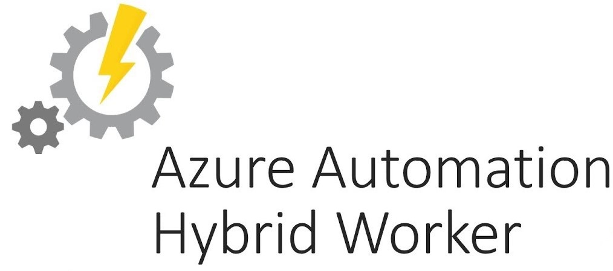

In my [previous article](https://bhargavacharychollaty.medium.com/use-azure-automation-state-configuration-to-deploy-and-monitor-self-hosted-agents-in-azure-devops-691047f7ff5) we have seen how we can use Azure Automation State Configuration to automate the deployment and monitoring of Self-hosted agents in Azure DevOps. In this article, we will see how we can  automatically sync PowerShell modules of hybrid workers from automation account to using state configuration.

### Before proceeding further…

- You need to have a basic understanding of [Azure Automation](https://docs.microsoft.com/en-us/azure/automation/automation-intro#process-automation) and [Desired State Configuration](https://docs.microsoft.com/en-us/powershell/scripting/dsc/overview/overview?view=powershell-7.1).
- You need to have an Azure Subscription. Create one from [this link](https://azure.microsoft.com/en-in/resources/videos/sign-up-for-microsoft-azure/) if you do not have any.
- You need to have an Azure Automation Account and Windows VM which needs to be used as hybrid worker deployed in a resource group.

## What is Azure Automation Hybrid Worker ?

A Hybrid Worker is a feature offered by Azure Automation, where the users can bring and connect their own compute resource to automation account for job execution. Hybrid workers help in overcoming few resource [limitations](https://docs.microsoft.com/en-us/azure/azure-resource-manager/management/azure-subscription-service-limits#automation-limits) that are applicable to azure sandboxes. They also come handy in scenarios where the runbook needs to access any on-premise resource which is not possible in azure sandboxes.

Apart from these there are many other scenarios where the hybrid workers are recommended. More details can be found [here](https://docs.microsoft.com/en-us/azure/automation/automation-runbook-execution#runbook-execution-environment).

## Using PS Modules in Hybrid Workers

A runbook defined in PowerShell can have dependency on PowerShell modules. If a runbook job has to be executed with out failure then all it dependency modules have to installed in the environment where the job is executed. This process is different for azure sandboxes and hybrid workers.

For azure sandboxes, it is handled by the automation service and all the dependency modules are automatically installed into the sandbox environment if the module is uploaded to automation account. But if the same modules have to be used then the user has to ensure that they are installed on all the worker machines. 

This is a very tedious work as a user could have huge number of workers and performing this operation manually on all will be time consuming. For custom modules the process will be even more difficult as the modules have to be manually copied to each worker machine. This also not a one time activity as there are frequent updates to azure modules are ensuring that the workers are in sync with automation account for each update is difficult.

What if we could sync the modules state of hybrid workers with that of the automation account with a single click of a button. We try to achieve the same with the help of automation state configuration.

Let us first try to understand how automation state configuration works  before jumping into the solution...

## How does Azure Automation State Configuration work ?

[Automation State Configuration](https://docs.microsoft.com/en-us/azure/automation/automation-dsc-overview) is an implementation of DSC (Desired State Configuration) pull server that can be used to onboard nodes to DSC in pull mode.

### DSC Pull Server:

A DSC pull server is a remote service that is provisioned with configurations and resources. This service exposes few endpoints which are used by the dsc nodes to download configurations and resources, in order to ensure that the nodes are in desired state. [DSC protocol](https://docs.microsoft.com/en-us/openspecs/windows_protocols/ms-dscpm/ea744c01-51a2-4000-9ef2-312711dcc8c9#:~:text=Specifies%20the%20Desired%20State%20Configuration,transfer%20of%20all%20protocol%20messages.) defines contracts for each of the endpoint and every pull server implementation should follow these contracts.

As automation state configuration implements dsc pull server, it has endpoints for each of the dsc protocol. Among these endpoints, there is an endpoint (ModuleContent, a GET request) which is used to download the modules for dsc (otherwise called as dsc resources) from the pull server and install them on the node. The pull server url that is used by the dsc to download the modules is configured in _'ResourceModuleManagers'_ settings of LCM

Since the hybrid worker node is being onboarded to automation state configuration, it is already able to download modules for dsc configurations from automation account. We will extend this logic to download any desired modules and sync the modules state.

## Sync PS Modules of Automation to Hybrid Workers.

Since none of the existing resource can serve our requirement we need to either use script resource or define a new resource. I have chosen the later option so that we can add additional functionality to the module in future. [This documentation](https://docs.microsoft.com/en-us/powershell/scripting/dsc/resources/authoringresourceclass?view=powershell-7.1) details the steps for creating a new resource.

### _New DSC Resource_

I have defined a new resource _'AutomationPSModuleResource'_ under module _'AutomationHybridWorkerDsc'_ with below logic.

_"If the module is not installed, the ResourceModuleManagers is retrieved from the LCM configuration and then a Get request is made for the required module and version. Once the module is downloaded it is installed in the location C:\Program Files\WindowsPowerShell\Modules"_

The resource has following four properties:
- <ins>Name</ins>: The name of the module to be installed.
- <ins>RequiredVersion</ins>: The version of the module to be installed.
- <ins>Ensure</ins>: Present or Absent the state of the module.
- <ins>ModuleBasePath</ins>: The location where the module is installed. Readonly property.

Source code is shown below…

```
enum Ensure
{
    Absent
    Present
}

[DscResource()]
class AutomationPSModuleResource {

    [DscProperty(Key)]
    [string] $Name

    [DscProperty(Key)]
    [string] $RequiredVersion

    [DscProperty(Mandatory)]
    [Ensure] $Ensure

    [DscProperty(NotConfigurable)]
    [string] $ModuleBasePath

    <#
        This method is equivalent of the Set-TargetResource script function.
        Here we try to ensure that the module provided is either present or absent.
    #>
    [void] Set()
    {
        $this.TestDscLcmRefreshMode()
        $moduleInstalled = $this.TestModuleInstallation()

        if ($this.ensure -eq [Ensure]::Present)
        {
            if(-not $moduleInstalled)
            {
                Write-Verbose -Message "Module is not installed. Attempting to install it now"
                $this.DownloadAndInstallModule()
            }
        }
        else
        {
            if ($moduleInstalled)
            {
                Write-Verbose -Message "Module is installed. Attempting to uninstall it now"
                $this.UnInstallModule()
            }
        }
    }

    <#
        This method is equivalent of the Test-TargetResource script function.
        It should return True or False, showing whether the resource
        is in a desired state.
    #>
    [bool] Test()
    {
        $this.TestDscLcmRefreshMode()
        $present = $this.TestModuleInstallation()

        if ($this.Ensure -eq [Ensure]::Present)
        {
            return $present
        }
        else
        {
            return -not $present
        }
    }

    <#
        This method is equivalent of the Get-TargetResource script function.
        The implementation should use the keys to find appropriate resources.
        This method returns an instance of this class with the updated key
         properties.
    #>
    [AutomationPSModuleResource] Get()
    {
        $this.TestDscLcmRefreshMode()
        $present = $this.TestModuleInstallation()

        if ($present)
        {
            $module = $this.GetModuleInfo($this.Name, $this.RequiredVersion)
            $this.Ensure = [Ensure]::Present
            $this.ModuleBasePath = $module.ModuleBase
        }
        else
        {
            $this.ModuleBasePath = [System.String]::Empty
            $this.Ensure = [Ensure]::Absent
        }

        return $this
    }

    <#
        Helper method to check if the required version of module is installed.
    #>
    [bool] TestModuleInstallation()
    {
        $present = $true

        Write-Verbose "Checking if the module is installed on the machine"
        $module = $this.GetModuleInfo($this.Name, $this.RequiredVersion)

        # if moduleinfo is null, it implies required version of module is not installed.
        if ($null -eq $module)
        {
            $present = $false
        }

        Write-Verbose -Message "Module install status: $present"
        return $present
    }

    <#
        Helper method to get the module info object for current module
    #>
    [PSModuleInfo] GetModuleInfo([string] $moduleName, [string] $moduleVersion)
    {
        # Get all the versions of module and filter the required version   
        Write-Verbose -Message "Retrieving module info from the machine for $moduleName for version $moduleVersion"
        $module = Get-Module -Name $moduleName -ListAvailable -ErrorAction Ignore | Where-Object { $_.Version -eq $moduleVersion }
        return $module
    }

    <#
        Helper method to download and install the required version of module from azure automation account
    #>
    [void] DownloadAndInstallModule()
    {
        $moduleRequestUrlFormat = "{0}/Modules(ModuleName='{1}',ModuleVersion='{2}')/ModuleContent"
        $moduleDownloadPath = Join-Path $Env:TEMP "$(New-Guid).zip"
        $moduleInstallationPath = "C:\Program Files\WindowsPowerShell\Modules\$($this.Name)\$($this.RequiredVersion)"

        Write-Verbose -Message "Retrieving ModuleManagers from LCM"
        $lcm = Get-DscLocalConfigurationManager -ErrorAction Continue
        
        # Retrieve the module server url
        if ($null -ne $lcm -and $null -ne $lcm.ResourceModuleManagers -and $lcm.ResourceModuleManagers.Count -gt 0)
        {
            $moduleServerUrl = $lcm.ResourceModuleManagers[0].ServerURL
        }
        else 
        {
            throw "Could not retrieve ResourceModuleManagers from the LCM"
        }

        # Retrieve the client auth certificate for Oaas DSC
        Write-Verbose -Message "Retrieving client authentication certificates from certificate store."
        $clientCerts = Get-ChildItem -Path cert:\LocalMachine\My | Where-Object {$_.FriendlyName -eq 'DSC-OaaS Client Authentication'} | Sort-Object -Property NotAfter -Descending 

        if ($null -eq $clientCerts -or $clientCerts.Count -eq 0)
        {
            throw "Could not retrieve ClientAuthentication certificate for DSC pull server"
        }

        # Construct the module request URL
        $moduleRequestUrl = $moduleRequestUrlFormat -f $moduleServerUrl, $this.Name, $this.RequiredVersion

        try 
        {
            Write-Verbose -Message "Trying to download module from module managers"
            Invoke-RestMethod -Uri $moduleRequestUrl -Method Get -Certificate $clientCerts[0] -Headers @{ProtocolVersion='2.0'} -UseBasicParsing -OutFile $moduleDownloadPath  | Out-Null
            Expand-Archive -Path $moduleDownloadPath -DestinationPath $moduleInstallationPath -Force  | Out-Null
            Remove-Item -Path $moduleDownloadPath -Force  | Out-Null
            Write-Verbose -Message "Succesfully downloaded and installed the module"
        }
        catch 
        {
            throw "Error occured while trying to download and install module $_"
        }
    }

    <#
        Helper method to check if the DSC LCM is setup in PULL mode for the resource to work.
    #>
    [void] TestDscLcmRefreshMode()
    {
        $requiredDscLcmRefreshMode = 'PULL'

        Write-Verbose -Message "Cheking LCM refresh mode"
        $lcm = Get-DscLocalConfigurationManager -ErrorAction Continue

        if($null -eq $lcm -or [System.String]::Compare($requiredDscLcmRefreshMode, $lcm.RefreshMode, $true) -ne 0)
        {
            throw "HybridWorkerModule resource can only be used in $requiredDscLcmRefreshMode mode of DSC"
        }
        else
        {
            Write-Verbose -Message "The LCM refresh mode is $requiredDscLcmRefreshMode"
        }
    }

    <#
        Helper method to uninstall the module if it is already installed
    #>
    [void] UnInstallModule()
    {
        $module = $this.GetModuleInfo($this.Name, $this.RequiredVersion)

        if($null -eq $module)
        {
            Write-Verbose -Message "The module is not installed. Uninstallation is skipped."
        }
        else
        {
            Write-Verbose -Message "The module is installed at $($module.ModuleBase). Purging all the files to uninstall the module."
            Remove-Item -Path $module.ModuleBase -Recurse -Force
            Write-Verbose -Message "The module is succesfully uninstalled."
        }
    }

}
```

### _DSC Configuration for Module Sync_

Now that we have created a new resource to download and install a module from automation account, let us use this resource to define a configuration which includes all the modules that are currently imported to the automation account. Since any automation account has few default modules used by the service itself, we need to ignore them from the configuration. To achieve this we get all the modules that are uploaded to an account by connecting to the azure subscription and loop through the module list to create the config.

Below configuration for syncing all modules. It assumes that the automation account name and its resource group name are created as variables.

```
Configuration SyncHybridWorkerModules
{
    param
    (
        [Parameter(Mandatory = $false)]
        [string[]]$ModuleToIgnore = @()
    )

    Import-DSCResource -Module AutomationHybridWorkerDsc

    # These modules will be excluded from sync by default always
    $builtInModules = @("Microsoft.PowerShell.Diagnostics","Microsoft.WSMan.Management", "Microsoft.PowerShell.Utility", "Microsoft.PowerShell.Security")
    $builtInModules += @("Microsoft.PowerShell.Management", "GPRegistryPolicyParser", "Orchestrator.AssetManagement.Cmdlets")
    $dscModules = @("AuditPolicyDsc","ComputerManagementDsc","PSDscResources", "SecurityPolicyDsc", "StateConfigCompositeResources", "xDSCDomainjoin", "xPowerShellExecutionPolicy", "xRemoteDesktopAdmin")

    $ModuleToIgnore += $builtInModules
    $ModuleToIgnore += $dscModules

    # Connect to azure
    Connect-AzAccount -Identity

    # Retrieve the automation account details
    $automationAccountName = Get-AutomationVariable -Name 'AutomationAccountName'
    $automationAccountRGName = Get-AutomationVariable -Name 'automationAccountRGName'

    # Retrieve the automation account modules list and filter it
    $modules = Get-AzAutomationModule -AutomationAccountName $automationAccountName -ResourceGroupName $automationAccountRGName
    $modules = $modules | Where-Object { $_.Name -notin $ModuleToIgnore }

    foreach($module in $modules)
    {
        if (-not [System.String]::IsNullOrEmpty($module.Version))
        {
            $resourceName = $module.Name.Replace(".","_")
            AutomationModuleResource $resourceName
            {
                Name = $module.Name
                RequiredVersion = $module.Version
                Ensure = "Present"
            }  
        }
        else
        {
            throw "Version info could not be retrieved for $($module.Name)"
        }      
    }
}
```

### _Import and Compile the DSC Configuration_

Let us now, import the configuration that we have created so far into an azure automation account and compile it.

1. Create Automation Variables to store account name and account resource group name.

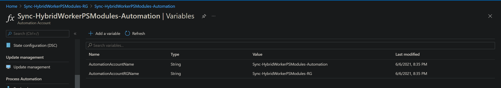
*Variables Created in Automation* 

2. Import _'SyncHybridWorkerModules.ps1'_ that we have define above.

    ```
    # Import the DSC configuration
    Import-AzAutomationDscConfiguration `
        -ResourceGroupName <AutomationResourceGroup> `
        –AutomationAccountName <AutomationName> `
        -SourcePath <Path-To-SyncHybridWorkerModules.ps1> `
        -Force -Published
     ```

3. Compile the DSC configuration. If there is a need to skip any modules from being synced, they need to be passed in to the configuration as parameters. Here we do not pass any parameter so all modules will be synced.
    ```
    # Compile the DSC configuration
    Start-AzAutomationDscCompilationJob `
        -ResourceGroupName <AutomationResourceGroup> `
        -AutomationAccountName <AutomationName> `
        -ConfigurationName 'SyncHybridWorkerModules'
    ```

_Note:_
- _The configuration requires AutomationHybridWorkerDsc, Az.Automation and Az.Account modules to be imported. Ensure they are imported before you compile the configuration._
- _The configuration uses managed identity to connect to azure and retrieve the current modules of account. Ensure that identity is enabled and required permissions are provided to it on account resource. You can learn more [here](https://docs.microsoft.com/en-us/azure/automation/enable-managed-identity-for-automation)._

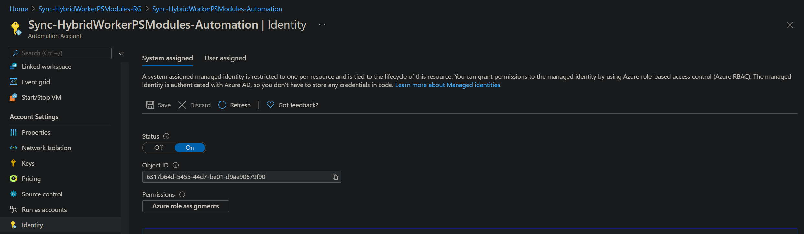
*System Identity enabled in automation*

Once the configuration compilation is completed, there should be able to see the node configuration.

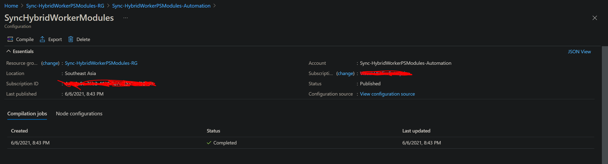
*Compiled DSC Node Configurations in Automation*

### _Register VM as Automation Hybrid Worker_

We need to register a VM as a hybrid worker to the automation account. I am skipping the steps as a detailed documentation is available here.

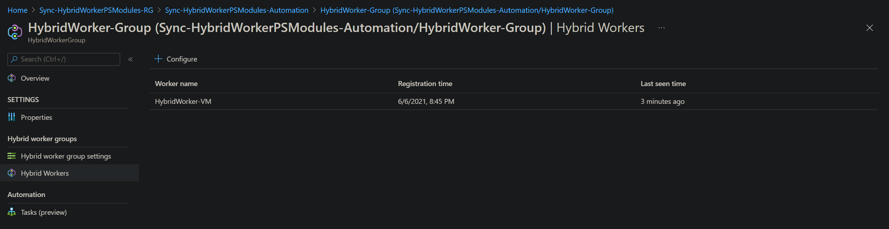
*Hybrid Worker registered in automation*

Let us say, we have a runbook 'Audit-AzureResources.ps1' which queries all the azure resources and reports resources which do not have a owner tag created. For reporting, it uses a custom module _'Audit.Resources'_. This is a very simple module with logs the resource state to console.

We will import all the dependency modules (_Az.Accounts, Az.Resources_ and _Audit.Resources_) to the account and start the runbook in the azure. We can see that it is successful.

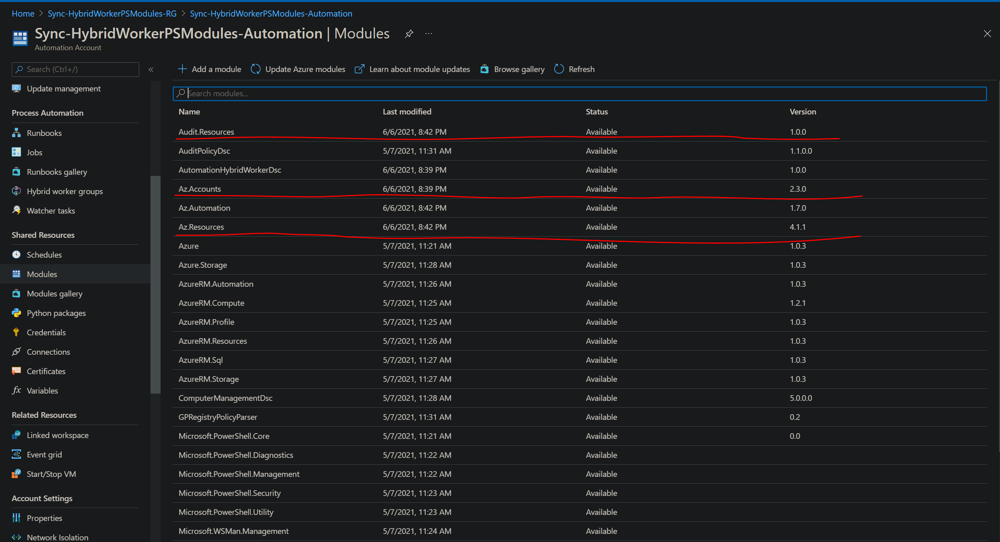
*Required modules imported into automation*

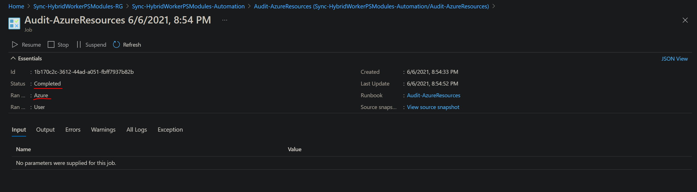
*Runbook executed successfully on azure*

If we try to run the same runbook on hybrid worker we can see that it will fail as the modules are not installed on the worker.

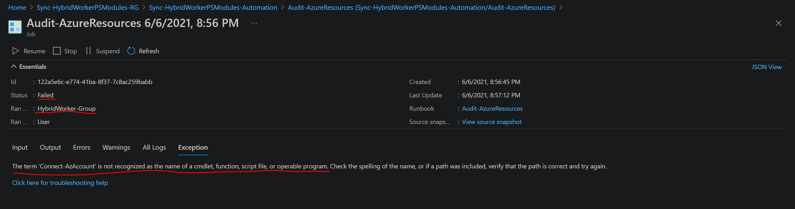
*Runbook failed on hybrid worker*

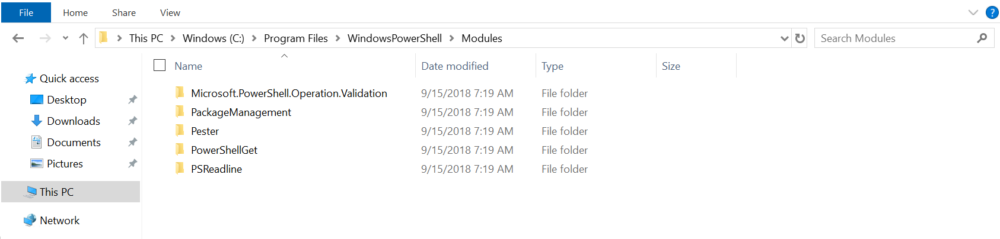
*List of modules installed on hybrid worker before DSC*

### _Onboard the Hybrid Worker to Automation DSC_

We have node configuration needed for module sync to hybrid worker. Let us now onboard the hybrid worker to Automation DSC. We are using _'ApplyAndAutoCorrect'_ as the configuration mode, this will apply the configuration and also ensure that the modules are always installed even if someone manually deletes them.

    ```
    Register-AzAutomationDscNode `
        -ResourceGroupName <AutomationResourceGroup> `
        -AutomationAccountName <AutomationName> `
        -AzureVMName <AzureVMName> `
        -AzureVMResourceGroup <AzureVMResourceGroup> `
        -AzureVMLocation <AzureVMLocation> `
        -NodeConfigurationName 'SyncHybridWorkerModules.localhost' `
        -ConfigurationMode 'ApplyAndAutoCorrect' `
        -ConfigurationModeFrequencyMins 15 `
        -RefreshFrequencyMins 30
    ```

Once the node is registered and reported compliant to automation dsc, you should be able to see that all the modules imported in automation are synced to the hybrid worker.

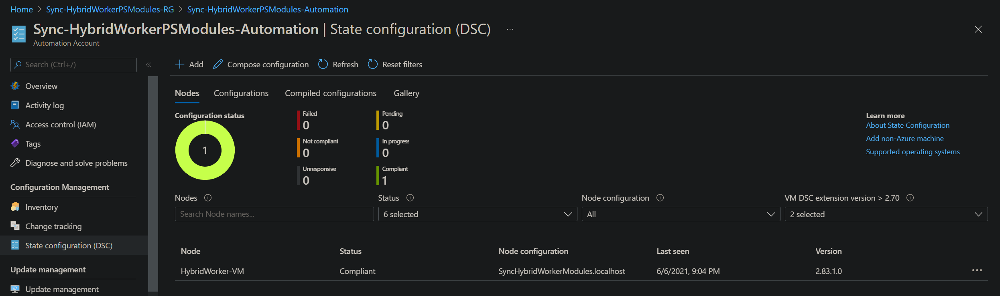
*Hybrid Worker onboarded to DSC and reporting compliant*

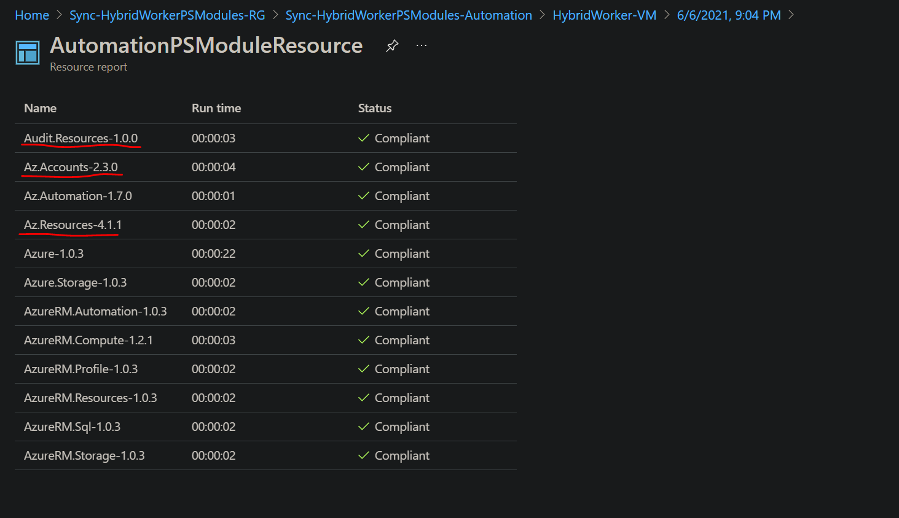
*DSC node report showing the modules that are synced*

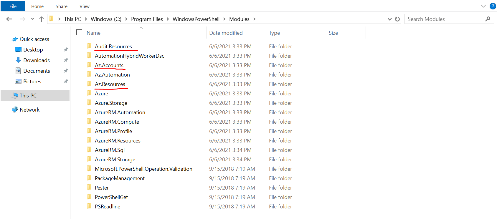
*List of modules installed on hybrid worker after DSC*

If we try to run our runbook in the hybrid worker it should be successful with out any errors.

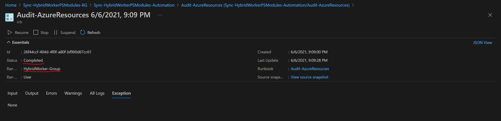
*Runbook executed successfully on hybrid worker*

# Update or Add Modules After Initial Sync

We have seen example of how we can sync all the modules in the automation account to hybrid workers. For adding new modules or updating existing modules simply do the operation in automation account and the re-compile the configuration. The node status will change to Pending and DSC will automatically update the modules as needed on the hybrid workers and report compliant.

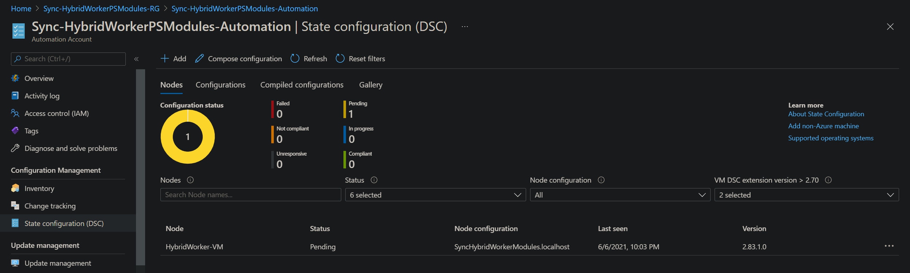
*DSC status showing pending after modules are updated*

# Source Code

- [DSC Resource AutomationHybridWorkerDsc.](./AutomationHybridWorkerDsc)
- [DSC Configuration SyncHybridWorkerModules.](./SyncHybridWorkerModules.ps1)
- [Deployment Commands.](./AzureDeploy.ps1)
- [Sample Runbook Audit-AzureResources](./Audit-AzureResources.ps1)
- [Sample Custom Module Audit.Resource](./Audit.Resources)